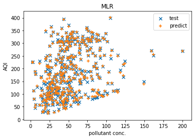
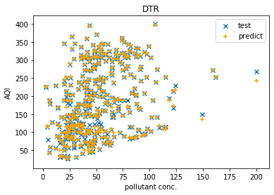
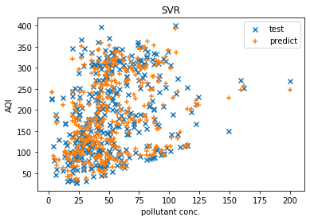
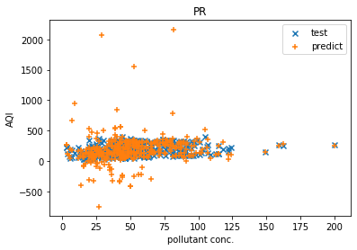

## Pune AQI Prediction Lab


End-to-end **machine learning pipeline + Streamlit dashboard** for comparing regression models that predict **Air Quality Index (AQI)** from CPCB-style pollutant readings for **Pune** (and other cities if present in the dataset).

---

## Overview

This repository:
- **Loads + cleans** the AQI dataset with robust column standardization (`src/pune_aqi/data/cleaning.py`)
- **Trains and compares** multiple regressors using sklearn Pipelines (consistent preprocessing)
- Serves results through a **high-contrast neon Streamlit dashboard**

---

## Tech stack

- **Python**: 3.10+
- **Data**: Pandas, NumPy
- **ML**: scikit-learn
- **Dashboard**: Streamlit + Plotly

---

## Project structure

```text
app/                    # Streamlit frontend
src/pune_aqi/           # ML + data code (modular package)
data/raw/pune_aqi/      # Raw dataset files
data/processed/         # Generated artifacts (gitignored)
notebooks/              # Exploration notebooks
assets/images/          # Images for docs
scripts/                # CLI utilities
```

---

## Setup

### 1) Create and activate a virtual environment

Windows (PowerShell):

```bash
python -m venv .venv
.venv\Scripts\Activate.ps1
```

### 2) Install dependencies

```bash
pip install -r requirements.txt
```

---

## Run the Streamlit dashboard

From the repository root:

```bash
streamlit run app/streamlit_app.py
```

The app defaults to:
- `data/raw/pune_aqi/state_weather_aqi_data_mf2.csv`

You can also paste a different CSV path in the sidebar.

---

## CLI utilities

### Convert XML → CSV

```bash
python scripts/convert_xml_to_csv.py --xml "data/raw/pune_aqi/weather data xml/data_aqi_cpcb (14).xml" --out "data/processed/aqi_from_xml.csv"
```

### Train models from the default dataset

```bash
python scripts/train_model.py --test-size 0.25 --random-state 0
```

---

## Dataset

Source: Open Government Data (OGD) Platform India (AQI by monitoring stations).  
See: `https://data.gov.in/resources/real-time-air-quality-index-various-locations`

---

## Screenshots

Legacy model plots (migrated into `assets/images/`):






